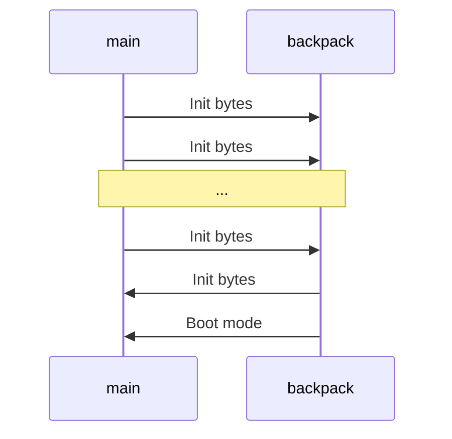

```mermaid
sequenceDiagram
    participant m as main
    participant b as backpack
    m->>b: Init bytes
    m->>b: Init bytes
    Note over m,b: ...
    m->>b: Init bytes
    b->>m: Init bytes
    b->>m: Boot mode
```
